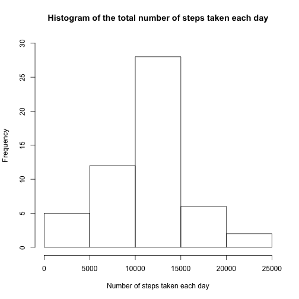
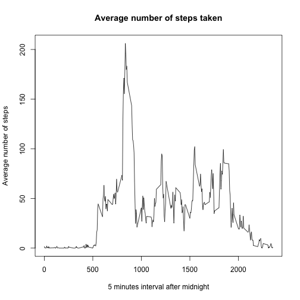
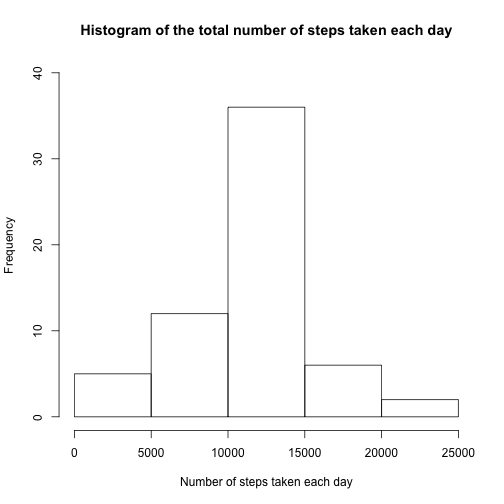
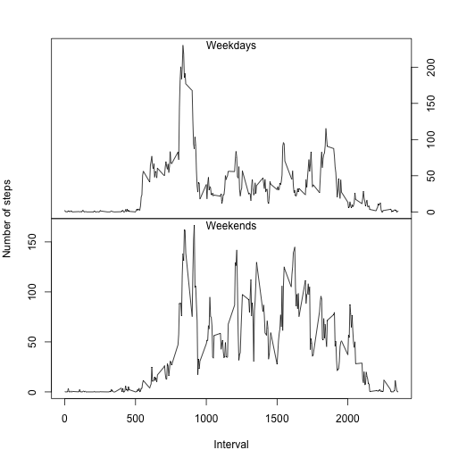

# Reproducible Research - Pear Assessment 1
## Author: Carlos S.
## Date: October 17, 2015

***

### Loading and preprocessing the data

#### 1. Load the data (i.e. read.csv())
#### 2. Process/transform the data (if necessary) into a format suitable for your analysis


```r
setwd("~/Desktop/_Coursera/Data Science Certification/05 - Reproducible Research/Project 1")
activity_df <- read.csv("activity.csv",na.strings="NA")
# create version of dataframe without NA values for first part of assignment
df <- activity_df[!is.na(activity_df$steps),]
```

### What is mean total number of steps taken per day?

#### 1. Calculate the total number of steps taken per day
#### 2. Make a histogram of the total number of steps taken each day
#### 3. Calculate and report the mean and median of the total number of steps taken per day


```r
library("plyr")

# Per instructions will ignore missing values for the 3 calculations below
# will use dataframe "df" which has no NA values for steps

# Calculate the total number of steps taken per day
per_day_df <- ddply(df,.(date),summarize,total_steps=sum(steps))
	
# Create histogram of the total number of steps taken each
hist(per_day_df$total_steps,
     main="Histogram of the total number of steps taken each day",
     xlab="Number of steps taken each day",
     ylim=c(0,30))
```

 

```r
# Mean of the total number of steps taken per day
mean(per_day_df$total_steps)
```

```
## [1] 10766.19
```

```r
# Median of the total number of steps taken per day
median(per_day_df$total_steps)
```

```
## [1] 10765
```

### What is the average daily activity pattern?

#### 1. Make a time series plot (i.e. type = "l") of the 5-minute interval (x-axis) and the average number of steps taken, averaged across all days (y-axis)
#### 2. Which 5-minute interval, on average across all the days in the dataset, contains the maximum number of steps?


```r
# continue to igonore missing values
# will use dataframe "df" which has no NA values for steps

# time series of 5 minute interval and avg number of steps taken accross all days
per_interval_df <- ddply(df,.(interval),summarize,interval_steps=mean(steps))
    
# make a time series plot of the 5-minute interval (x-axis) and average number of steps taken
plot(per_interval_df,type="l",
     main="Average number of steps taken", 
     xlab="5 minutes interval after midnight", 
     ylab="Average number of steps")
```

 

```r
# interval containing the maximum number of steps
per_interval_df[per_interval_df$interval_steps==max(per_interval_df$interval_steps),1]
```

```
## [1] 835
```

### Imputing missing values

#### 1. Calculate and report the total number of missing values in the dataset (i.e. the total number of rows with NAs)
#### 2. Devise a strategy for filling in all of the missing values in the dataset. The strategy does not need to be sophisticated. For example, you could use the mean/median for that day, or the mean for that 5-minute interval, etc.
#### 3. Create a new dataset that is equal to the original dataset but with the missing data filled in.
#### 4. Make a histogram of the total number of steps taken each day and Calculate and report the mean and median total number of steps taken per day. Do these values differ from the estimates from the first part of the assignment? What is the impact of imputing missing data on the estimates of the total daily number of steps?


```r
# Calculate and report the total number of missing values in the dataset
sum(is.na(activity_df))
```

```
## [1] 2304
```

```r
# Strategy to impute values: 
# Fact: All NA values are in column steps, so we will impute values for this column only
# Will split original dataframe into 2 segments: 
#     seg1 will have rows with NA values only 
#     seg2 will have rows with no NA values
# Will impute NA values for seg1 to the average number of steps taken on 5 minutes
#     interval averaged across all days
# Will merge seg1 and seg2 to obtain 1 single dataframe with all data but no NA values

# create df_na from activity_df with rows with NA values only
df_na <- activity_df[is.na(activity_df$steps),]
    
# merge df_na with per_interval_df and extract only columns that matter
df_imputed <- merge(df_na, per_interval_df, by="interval")[c("interval_steps","date","interval")]
    
# rename interval_steps column to match original column name
df_imputed <- rename(df_imputed, c(interval_steps="steps"))
    
# create a new dataset that is equal to the original dataset but with the missing data filled in.
# add imputed rows to "df" dataframe which was created by removing na rows from original dataframe
activity_df_new <- rbind(df , df_imputed)
    
# Calculate the total number of steps taken per day using the new dataset with imputed values
per_day_df_new <- ddply(activity_df_new,.(date),summarize,total_steps=sum(steps))
    
# make histogram of total number of steps taken each day
hist(per_day_df_new$total_steps, 
    	main="Histogram of the total number of steps taken each day",
    	xlab="Number of steps taken each day",
    	ylim=c(0,40))
```

 

```r
# Mean of the total number of steps taken per day, now using dataframe with imputed values
mean(per_day_df_new$total_steps)
```

```
## [1] 10766.19
```

```r
# Median of the total number of steps taken per day, now using dataframe with imputed values
median(per_day_df_new$total_steps)
```

```
## [1] 10766.19
```

```r
# Impact of imputing missing data with the above method?	
# Median changed; Now we have Mean = Median 
```

### Are there differences in activity patterns between weekdays and weekends?

#### 1. Create a new factor variable in the dataset with two levels – “weekday” and “weekend” indicating whether a given date is a weekday or weekend day.
#### 2. Make a panel plot containing a time series plot (i.e. type = "l") of the 5-minute interval (x-axis) and the average number of steps taken, averaged across all weekday days or weekend days (y-axis). See the README file in the GitHub repository to see an example of what this plot should look like using simulated data.


```r
# create new factor variable with two levels - "weekday" and "weekend"
activity_df_new <- within(activity_df_new,{
		type_of_day <- NA
		type_of_day[weekdays(as.Date(date)) %in% c("Saturday","Sunday")] <- "weekend"
		type_of_day[!(weekdays(as.Date(date)) %in% c("Saturday","Sunday"))] <- "weekday"
})
activity_df_new$type_of_day <- as.factor(activity_df_new$type_of_day)
	
# split dataframe into 2 parts, one with weekend data, another with weekday data
attach(activity_df_new)
df_weekday <- activity_df_new[type_of_day=="weekday",]
df_weekend <- activity_df_new[type_of_day=="weekend",]
detach(activity_df_new)
	
# time series of 5 minute interval and avg number of steps taken accross all days (weekdays and weekend days)
df_weekday_ts <- ddply(df_weekday,.(interval),summarize,interval_steps=mean(steps))
df_weekend_ts <- ddply(df_weekend,.(interval),summarize,interval_steps=mean(steps))
    
# make a time series plot of the 5-minute interval (x-axis) and average number of steps taken
par(mfrow = c(2, 1),mar=rep(0,4), oma = c(4,4,3,3))
plot(df_weekday_ts,type="l", xlab="", axes=FALSE)	
box(); axis(4); 
mtext("Weekdays", side = 3, line = -1)
plot(df_weekend_ts,type="l", xlab="", axes=FALSE)
box(); axis(1); axis(2); 
mtext("Weekends", side = 3, line = -1)
mtext("Interval", side = 1, line = 3 )
mtext("Number of steps", side = 2, outer = TRUE, line = 3)
```

 
